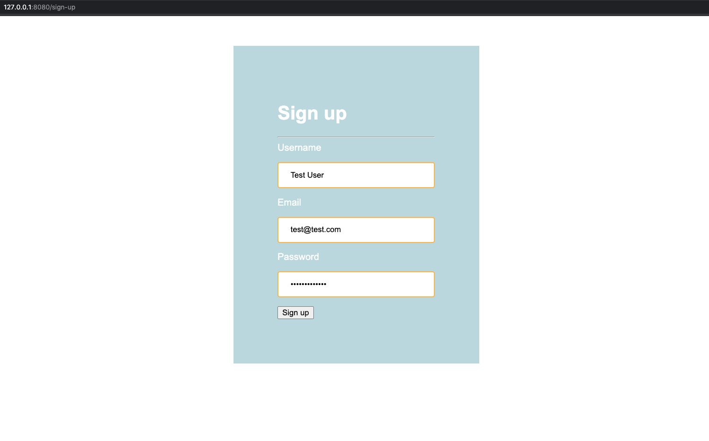
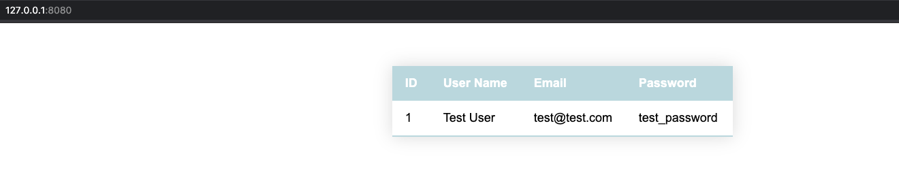

# working-with-flask-forms
Working with forms and form data in Flask

This repo demostrates how to work with web forms in Flask.

We start out with a basic Flask app that develops into a sign-up page that includes a web form that connects to back-end.

We then go on to style the form using CSS and add a database that we interact with through SQLAlchemy(ORM).

Take a look:

**http://127.0.0.1:8080/sign-up**

**http://127.0.0.1:8080/**

